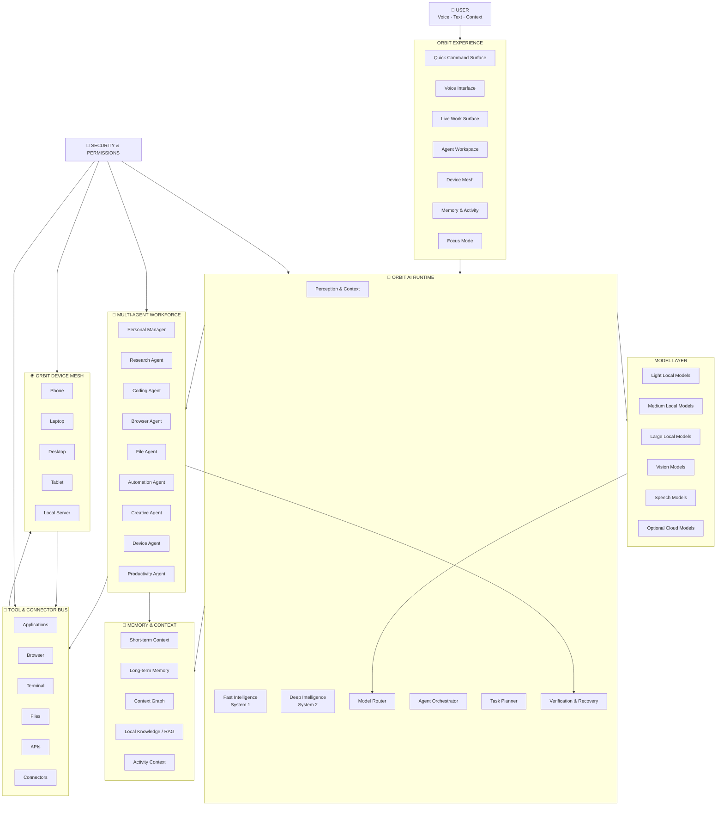

<p align="center">
  <br/>
  <a href="./LICENSE"></a>
  <a href="https://github.com/mananbharti/orbit/stargazers"></a>
  <a href="https://github.com/mananbharti/orbit/issues"></a>
  <a href="https://buymeachai.in/mananbharti"></a>
  <a href="https://discord.gg/xQ3VaAnmPA"></a>
  <br/>
  <br/>
  
  
  
  
  <br/>
  <br/>
</p>

<p align="center">
  
</p>

<h1 align="center">Orbit</h1>

<h3 align="center">Your AI. Your devices. Your agents. Your ecosystem.</h3>

<p align="center">
  A local-first, open-source AI ecosystem that connects your devices, applications, models, tools, memory and autonomous agents into one personal runtime.
</p>

<p align="center">
  <b>One ecosystem · Multiple agents · Any model · Any device</b>
</p>

<br/>

<a href="https://github.com/mananbharti/orbit">
  
</a>

<br/>

> [!NOTE]
> Orbit is in active early development. Features listed below reflect the current build plan — check the [Roadmap](#roadmap) for what's shipped vs. planned.

> [!WARNING]
> ⚠️ Orbit is not a remote-desktop tool. It does not stream your screen or provide screen-sharing/remote-viewing — see [What Orbit Is Not](#what-orbit-is-not).

<br/>

<details>
<summary><b>📑 Table of Contents</b></summary>
<br/>

* [What is Orbit?](#what-is-orbit)
* [Why I Built This](#why-i-built-this)
* [The Orbit Vision](#the-orbit-vision)
* [Demo](#demo)
* [Features](#features)
* [AI Ecosystem](#ai-ecosystem)
* [Multiple AI Agents](#multiple-ai-agents)
* [AI Runtime](#ai-runtime)
* [Models](#models)
* [Personal Intelligence](#personal-intelligence)
* [Productivity & Focus](#productivity--focus)
* [Voice & Natural Interaction](#voice--natural-interaction)
* [Computer & App Control](#computer--app-control)
* [Memory & Context](#memory--context)
* [Files & Knowledge](#files--knowledge)
* [Web & Research](#web--research)
* [Connectors & Tools](#connectors--tools)
* [Automation](#automation)
* [Cross-Device AI](#cross-device-ai)
* [How Orbit Looks](#how-orbit-looks)
* [Orbit vs. Alternatives](#orbit-vs-alternatives)
* [Supported Platforms](#supported-platforms)
* [Architecture](#architecture)
* [Security & Privacy](#security--privacy)
* [Getting Started](#getting-started)
* [Roadmap](#roadmap)
* [What Orbit Is Not](#what-orbit-is-not)
* [FAQ](#faq)
* [Repository Activity](#repository-activity)
* [Star History](#star-history)
* [Contributing](#contributing)
* [Support the Project](#support-the-project)
* [Built With](#built-with)
* [License](#license)

</details>

<br/>

---

## What is Orbit?

Apple's Continuity — Handoff, Universal Clipboard, AirDrop — only works between Apple devices. Mix an iPhone with a Windows or Linux PC, or an Android phone with any desktop, and that seamlessness disappears.

**Orbit brings it back, for any combination of devices.**

A companion app for your phone and a lightweight service for your PC, connected over a fast local channel, giving you instant clipboard sync, direct file transfer, and full remote control — no cloud round-trips, no vendor lock-in.

But Orbit is designed to become much more than device continuity.

### Orbit is a personal AI ecosystem.

It connects:

* your devices
* your applications
* your files
* your AI models
* your AI agents
* your memory
* your tasks
* your automations
* your tools
* your workflows

through one persistent runtime.

Instead of opening a different application for every task, Orbit gives you one environment where AI can understand your context, plan work, delegate tasks, operate applications, use tools, and continue working across your devices.

> **Orbit is not an AI model. Orbit is the harness and ecosystem around AI.**

The model can change.

The device can change.

The agent can change.

The tools can change.

**Your Orbit stays the same.**

<br/>

---

## Why I Built This

I got tired of emailing files to myself and losing clipboard content every time I switched between my phone and my PC — especially since my devices don't all live in the same ecosystem.

Existing tools either lock you into one vendor or solve only one part of the problem.

Orbit started as an attempt to build the tool I actually wanted:

> **One seamless layer connecting all my devices, regardless of what operating system they run.**

The vision has now expanded.

Computers are becoming capable of running powerful local AI, and AI systems are becoming capable of operating software rather than simply answering questions.

Orbit brings those ideas together.

Instead of having:

```text
AI app
+ productivity app
+ automation app
+ remote-control app
+ file-sharing app
+ task manager
+ local AI runtime
+ agent framework
+ separate tools
```

Orbit aims to provide:

```text
                         ORBIT
                           │
       ┌───────────────────┼───────────────────┐
       │                   │                   │
     Devices             AI                    Tools
       │                   │                   │
   Phone/Laptop       Agents/Models       Apps/Browser/APIs
       │                   │                   │
       └───────────────────┼───────────────────┘
                           │
                    One ecosystem
```

---

# The Orbit Vision

Orbit is designed to become a **personal AI operating layer**.

You should not have to think:

> Which AI should I use?

> Which application should I open?

> Which model should I select?

> Which device has enough compute?

> Which agent should handle this?

> Where is that file?

> How do I automate this?

You should be able to say:

> **"Orbit, handle this."**

Orbit can then understand the goal, determine what needs to happen, select the appropriate model and agents, use the required tools, execute the work, verify the result, and return the outcome.

### From AI that answers → AI that works.

```text
User
  ↓
Understand
  ↓
Plan
  ↓
Delegate
  ↓
Execute
  ↓
Verify
  ↓
Remember
  ↓
Continue
```

The long-term goal is not a single assistant window.

It is an **ecosystem of intelligence that works with the user across their entire computing environment.**

---

# Demo

<!-- 🖼️ BOILERPLATE: Add a hosted demo link or demo GIF once available -->

A live demo will be linked here once Orbit reaches a public beta.

The planned experience includes:

* persistent AI presence
* natural voice/text interaction
* multiple active agents
* live task progress
* cross-device continuity
* local AI
* computer control
* files and applications
* proactive assistance
* background work

---

# Features

## Existing Device & Continuity Features

| Feature                                           | Mobile | Desktop |
| :------------------------------------------------ | :----- | :------ |
| Bidirectional clipboard sync                      | Yes    | Yes     |
| Clipboard history across devices                  | Yes    | Yes     |
| Direct file transfer (no cloud)                   | Yes    | Yes     |
| Native share-sheet integration                    | Yes    | N/A     |
| Drag-and-drop file drop zone                      | N/A    | Yes     |
| Auto-organize transferred files                   | N/A    | Yes     |
| Photo auto-backup to PC                           | Yes    | Yes     |
| Customizable app launcher grid                    | Yes    | N/A     |
| Context-aware launcher ("scenes")                 | Yes    | N/A     |
| Full mouse/touchpad control                       | Yes    | N/A     |
| Gyroscope mouse mode                              | Yes    | N/A     |
| Full keyboard input + custom macros               | Yes    | N/A     |
| System volume & per-app audio mixer               | Yes    | Yes     |
| Power control (shutdown/sleep/restart/lock)       | Yes    | Yes     |
| Wake-on-LAN                                       | Yes    | N/A     |
| Display brightness & mode control                 | Yes    | Yes     |
| Presentation mode (slides + laser pointer)        | Yes    | N/A     |
| Browser tab control                               | Yes    | Yes     |
| QR pairing + biometric confirmation               | Yes    | Yes     |
| Per-device permission scoping                     | N/A    | Yes     |
| Activity log & panic lock                         | Yes    | Yes     |
| Automation / scheduled actions                    | Yes    | Yes     |
| Multi-PC support                                  | Yes    | N/A     |
| Developer/terminal remote access                  | Yes    | Yes     |
| AI-driven natural-language PC control *(planned)* | —      | —       |

## AI Features

| Capability                        |  Status |
| --------------------------------- | :-----: |
| Local AI                          | Planned |
| Cloud AI as optional backend      | Planned |
| Automatic model selection         | Planned |
| Fast AI routing                   | Planned |
| Deep reasoning                    | Planned |
| Multi-agent execution             | Planned |
| Parallel agents                   | Planned |
| Persistent agents                 | Planned |
| Agent-to-agent communication      | Planned |
| Background AI workers             | Planned |
| Personal memory                   | Planned |
| Context-aware assistance          | Planned |
| Natural-language computer control | Planned |
| Voice assistant                   | Planned |
| Streaming voice interaction       | Planned |
| Task management                   | Planned |
| Notes                             | Planned |
| Reminders                         | Planned |
| Habits                            | Planned |
| Calendar intelligence             | Planned |
| Focus mode                        | Planned |
| Productivity analytics            | Planned |
| Proactive suggestions             | Planned |
| Browser automation                | Planned |
| Web research                      | Planned |
| Document understanding            | Planned |
| OCR                               | Planned |
| Image understanding               | Planned |
| Image generation/editing          | Planned |
| Code generation                   | Planned |
| Code execution                    | Planned |
| App automation                    | Planned |
| Connector ecosystem               | Planned |
| Long-running tasks                | Planned |
| Scheduled agents                  | Planned |
| Cross-device AI state             | Planned |
| Device-aware AI execution         | Planned |
| Local knowledge / RAG             | Planned |
| Agent permissions                 | Planned |
| AI activity timeline              | Planned |

<br/>

---

# AI Ecosystem

Orbit is not built around one AI model or one agent.

It provides a runtime in which different models and agents can work together.

```text
                         ORBIT
                           │
                    Personal Context
                           │
              ┌────────────┴────────────┐
              │                         │
          FAST LAYER                DEEP LAYER
              │                         │
       Fast decisions             Deep reasoning
       Routing                     Research
       Actions                     Coding
       Reflexes                    Planning
              │                         │
              └────────────┬────────────┘
                           │
                    ORCHESTRATOR
                           │
              ┌────────────┼────────────┐
              │            │            │
            Agents       Memory       Tools
              │            │            │
              └────────────┼────────────┘
                           │
                     DEVICE MESH
                           │
          ┌────────┬───────┼───────┬────────┐
          │        │       │       │        │
        Phone    Laptop  Desktop  Tablet   Server
```

Orbit can combine:

* small fast local models
* larger local models
* vision models
* speech models
* coding models
* reasoning models
* optional cloud models

The user should not need to manually manage every model for every task.

---

# Multiple AI Agents

Orbit is **not a single-agent assistant**.

Multiple AI workers can operate simultaneously.

Each agent can have:

* a role
* a task
* memory
* tools
* permissions
* model preferences
* context
* workspace
* status
* execution history

Example:

```text
                    ORBIT
                      │
                 ORCHESTRATOR
                      │
       ┌──────────────┼──────────────┐
       │              │              │
   Researcher       Coder         Planner
       │              │              │
     Browser       Terminal      Calendar
       │              │              │
       └──────────────┼──────────────┘
                      │
                  Verifier
                      │
                   Result
```

### Example

User:

> "Research this topic, compare the options, create a spreadsheet and prepare a summary."

Orbit can run:

```text
Research Agent
    ↓
collects information

Analysis Agent
    ↓
compares information

Spreadsheet Agent
    ↓
creates structured data

Writing Agent
    ↓
creates summary

Verification Agent
    ↓
checks output
```

These workers can operate **in parallel** whenever their work is independent.

---

# Persistent AI Workers

Orbit can maintain persistent workers that can be activated whenever needed.

Examples:

### Personal Manager

Handles:

* tasks
* reminders
* planning
* calendar
* personal context

### Research Worker

Handles:

* web research
* source collection
* information extraction
* comparisons
* reports

### Coding Worker

Handles:

* code
* repositories
* terminal
* debugging
* testing
* development workflows

### Browser Worker

Handles:

* websites
* browser navigation
* forms
* repetitive web tasks
* research

### File Worker

Handles:

* local files
* folders
* PDFs
* documents
* organization
* extraction

### Productivity Worker

Handles:

* focus
* activity patterns
* distractions
* productivity analysis

### Automation Worker

Handles:

* scheduled tasks
* triggers
* recurring workflows
* background jobs

### Creative Worker

Handles:

* writing
* presentations
* images
* documents
* creative workflows

### Device Worker

Handles:

* connected devices
* system actions
* synchronization
* device state

These are logical workers, not necessarily separate models.

Multiple workers can share the same local model runtime or use different models depending on their requirements.

---

# AI Runtime

Orbit uses two complementary AI execution layers.

## Fast Intelligence

Simple tasks should not wait for a large reasoning model.

A lightweight local model can handle:

* intent detection
* routing
* tool selection
* simple decisions
* repetitive actions
* agent activation
* context prefetching
* low-latency commands
* UI actions

```text
Input
  ↓
Fast understanding
  ↓
Simple?
 ┌──┴──┐
YES    NO
 │      │
Action  Deep reasoning
```

This layer is designed to make Orbit feel extremely responsive.

## Deep Intelligence

Complex work can be routed to stronger models.

Examples:

* difficult reasoning
* coding
* research
* planning
* long documents
* complex workflows
* analysis
* architecture
* multi-step tasks

Orbit chooses the appropriate execution path based on the task.

---

# Models

Orbit is **model agnostic**.

The AI model is replaceable.

Possible backends include:

* local models
* quantized models
* vision models
* speech models
* coding models
* reasoning models
* optional cloud models
* user-provided models
* custom runtimes

### Hardware-Aware AI

Orbit can inspect available hardware:

```text
CPU
GPU
VRAM
RAM
NPU
Battery
Thermals
Network
        ↓
Hardware Profile
        ↓
Model Selection
        ↓
Runtime
```

A powerful desktop may run a larger model.

A laptop may run a medium model.

A phone may use a lightweight model.

A server can run background workers.

The ecosystem remains the same.

> **The model changes. Orbit does not.**

---

# Personal Intelligence

Orbit can become aware of the user's workflow without requiring the user to manually maintain everything.

With permission, Orbit can understand:

* tasks
* notes
* calendar
* habits
* activity
* frequently used applications
* projects
* files
* devices
* recurring workflows
* deadlines
* working patterns

This allows Orbit to answer questions such as:

> "What should I work on next?"

> "When am I usually most productive?"

> "What did I work on yesterday?"

> "Find the notes related to this project."

> "Plan my day."

> "I have three hours. What should I finish?"

---

# Productivity & Focus

Orbit can optionally become a personal productivity layer.

### Tasks

* natural-language task creation
* deadlines
* priorities
* subtasks
* task search
* task completion
* project grouping

### Reminders

* one-time reminders
* recurring reminders
* contextual reminders
* scheduled notifications
* device-aware notifications

### Habits

* habit creation
* habit tracking
* streaks
* progress
* recurring schedules
* habit reminders

### Calendar

* calendar integration
* schedule awareness
* free-time detection
* task scheduling
* deadline planning

### Focus

Orbit can optionally:

* start focus sessions
* close distracting applications
* block selected websites
* track focus duration
* restore blocked applications after the session
* provide productivity summaries

### Activity Intelligence

With explicit permission, Orbit can understand patterns such as:

* time spent in applications
* productive vs. distracting activity
* focus periods
* work patterns
* recurring distractions

All such monitoring should remain opt-in and privacy-controlled.

---

# Voice & Natural Interaction

Orbit should feel conversational.

Users can:

* speak
* type
* dictate
* interrupt
* continue previous tasks
* ask follow-up questions
* change instructions
* switch devices

Examples:

```text
"Plan my day."

"Remind me to finish this at 6."

"Open the project I was working on."

"Find the PDF about the project."

"Research this while I work."

"Tell the coding agent to fix this."

"Ask another agent to verify it."

"I'm leaving. Continue this on my desktop."

"Keep working and notify me when it's done."
```

---

# Work While You Speak

Orbit is designed around streaming interaction.

It should not always wait for the user to finish an entire sentence before preparing the task.

```text
User starts speaking
        ↓
Streaming speech recognition
        ↓
Fast intent detection
        ↓
Context retrieval
        ↓
Agent/model preparation
        ↓
User finishes
        ↓
Execution
```

While the user is speaking, Orbit can safely prepare:

* relevant context
* files
* applications
* agents
* tools
* models
* browser state

High-impact actions still require complete intent and appropriate permissions.

---

# Memory & Context

Orbit can maintain a local personal memory layer.

Possible memory includes:

* preferences
* projects
* tasks
* notes
* devices
* workflows
* decisions
* previous conversations
* agent history
* relevant files
* recurring patterns

### Context Graph

Instead of treating every piece of information as isolated text:

```text
Person
  │
Project
  ├── Files
  ├── Tasks
  ├── Notes
  ├── Conversations
  ├── Agents
  ├── Decisions
  └── Deadlines
```

This allows agents to retrieve related information more intelligently.

Memory should be:

* inspectable
* searchable
* editable
* deletable
* permission-controlled
* optionally disabled

---

# Files & Knowledge

Orbit can work directly with local information.

Capabilities can include:

* file search
* semantic file search
* PDF reading
* document understanding
* OCR
* scanned document processing
* image understanding
* folder analysis
* document summarization
* extraction
* comparison
* local knowledge bases
* retrieval-augmented generation

Example:

> "Read this project folder and prepare a summary."

```text
Find files
    ↓
Classify
    ↓
Read / OCR
    ↓
Extract
    ↓
Retrieve relevant context
    ↓
Reason
    ↓
Generate
    ↓
Verify
```

---

# Web & Research

When internet access is enabled, Orbit can perform research workflows.

Possible capabilities:

* search
* browse
* read pages
* compare sources
* collect information
* extract data
* summarize findings
* monitor information
* create reports
* save sources

Internet access can be disabled completely for offline/private environments.

```text
LOCAL
No internet required

HYBRID
Local by default
Web when allowed

ONLINE
Web + cloud tools available
```

---

# Computer & App Control

Orbit can turn AI into a computer-control layer.

Agents can interact with:

* applications
* browser
* windows
* tabs
* keyboard
* mouse
* clipboard
* terminal
* files
* folders
* system controls

Possible actions:

```text
Open application
Close application
Create file
Move file
Rename file
Search folder
Read document
Run command
Open terminal
Type
Click
Navigate
Open URL
Switch window
Control media
Change volume
Change display
Lock computer
Start focus mode
```

The goal is not:

> "Here are instructions for doing it."

The goal is:

> **"I did it."**

---

# Connectors & Tools

Orbit will provide an extensible tool and connector layer.

Connectors can expose controlled capabilities from:

* applications
* browsers
* APIs
* databases
* cloud services
* local services
* developer tools
* project management systems
* communication systems
* storage systems
* custom applications

Capabilities can include:

```text
Read
Write
Create
Update
Search
Execute
Observe
```

Each connector should have its own permissions.

Orbit should support compatible tool protocols and local tool servers without making the core runtime dependent on one provider.

---

# Automation

Orbit can convert repeated actions into workflows.

Examples:

> "Every morning, prepare my work plan."

> "When I connect my laptop, open my workspace."

> "When this file appears, organize it."

> "Every Friday, summarize my project activity."

> "When my focus session starts, block distractions."

> "When the research agent finishes, send the result to the writing agent."

Automations can be:

* scheduled
* event-driven
* conditional
* application-based
* device-based
* file-based
* agent-driven

---

# Background Work

Orbit is designed to continue working even when the user is doing something else.

Example:

```text
User
 │
 └── "Research this topic."
          │
          ↓
    Orbit starts task
          │
     ┌────┼────┐
     ↓    ↓    ↓
 Search  Read  Analyze
     │    │    │
     └────┼────┘
          ↓
       Verify
          ↓
      Save result
          ↓
    Notify user
```

Long-running tasks can continue in the background where the device and permissions allow.

---

# Cross-Device AI

Orbit is not just a collection of apps.

The goal is one persistent ecosystem.

```text
                ORBIT
                  │
       ┌──────────┼──────────┐
       │          │          │
     Phone      Laptop     Desktop
       │          │          │
       └──────────┼──────────┘
                  │
               Tablet
                  │
               Server
```

A task can start on one device and continue on another.

Example:

```text
Phone
  ↓
Voice request
  ↓
Orbit
  ↓
Laptop
  └── reasoning

Desktop
  └── heavy model

Server
  └── background workers

Phone
  ↓
Completion notification
```

Orbit can select the best device for a task based on:

* compute
* model availability
* battery
* network
* latency
* permissions
* task requirements

---

# How Orbit Looks

Orbit should not feel like a giant dashboard.

It should feel like a **quiet persistent presence**.

The default state can be minimal.

```text
                ─────────────
                    Orbit
                ─────────────
```

When activated, it expands into a lightweight command surface.

```text
┌───────────────────────────────────────────────────┐
│  Orbit                                      ● Ready│
│                                                   │
│  What are we working on?                          │
│                                                   │
│  ┌─────────────────────────────────────────────┐  │
│  │ Ask Orbit anything...                     🎙│  │
│  └─────────────────────────────────────────────┘  │
│                                                   │
│  Active work                                     │
│                                                   │
│  ● Research Agent          Working               │
│  ● Coding Agent            Working               │
│  ✓ File Agent              Completed             │
│                                                   │
└───────────────────────────────────────────────────┘
```

The interface should be:

* minimal
* fluid
* fast
* premium
* distraction-free
* voice-friendly
* keyboard-friendly
* responsive
* consistent across devices

---

# Orbit Workspaces

Orbit can expose different views depending on what the user is doing.

### Quick Surface

For:

* questions
* commands
* voice
* quick actions

### Live Work

Shows:

* active agents
* progress
* current actions
* waiting tasks
* completed work
* failures

### Agent Workspace

Shows:

```text
Personal Manager      Active
Research Agent        Working
Coding Agent          Working
Browser Agent         Waiting
Automation Agent      Scheduled
```

### Device Mesh

Shows:

```text
Laptop                 Online
Phone                  Online
Desktop                Online
Tablet                 Offline
Home Server            Online
```

### Memory

Search:

* conversations
* notes
* projects
* tasks
* files
* decisions
* activity

### Activity Timeline

Shows:

* agent actions
* device events
* completed tasks
* automations
* approvals
* notifications

---

# Orbit vs. Alternatives

|                                |      Orbit      | Apple Continuity |        KDE Connect       | Remote Mouse |
| ------------------------------ | :-------------: | :--------------: | :----------------------: | :----------: |
| Cross-ecosystem (any OS combo) |        ✅        |   ❌ Apple-only   | ⚠️ Android/Linux-focused |       ✅      |
| Clipboard sync                 |        ✅        |         ✅        |             ✅            |       ❌      |
| Direct file transfer           |        ✅        |         ✅        |             ✅            |       ❌      |
| App launcher / widget grid     |        ✅        |         ❌        |        ⚠️ Limited        |       ❌      |
| Full mouse/keyboard control    |        ✅        |         ❌        |        ⚠️ Limited        |       ✅      |
| No cloud round-trip            |        ✅        |         ✅        |             ✅            |       ✅      |
| Screen mirroring               | ❌ *(by design)* |  ⚠️ Sidecar only |             ❌            |       ❌      |
| Local AI                       |        ✅        |         ❌        |             ❌            |       ❌      |
| Multiple AI agents             |        ✅        |         ❌        |             ❌            |       ❌      |
| Background AI work             |        ✅        |         ❌        |             ❌            |       ❌      |
| Model choice                   |        ✅        |         ❌        |             ❌            |       ❌      |
| Personal AI memory             |        ✅        |         ❌        |             ❌            |       ❌      |
| AI computer control            |        ✅        |         ❌        |             ❌            |       ❌      |
| AI automation                  |        ✅        |         ❌        |            ⚠️            |       ❌      |
| Cross-device AI state          |        ✅        |         ❌        |             ❌            |       ❌      |
| Local-first architecture       |        ✅        |        ⚠️        |             ✅            |      ⚠️      |

---

# Supported Platforms

|                     |         iOS        |       Android      | Windows |  Linux  |
| ------------------- | :----------------: | :----------------: | :-----: | :-----: |
| **Orbit Mobile**    |          ✅         |          ✅         |    —    |    —    |
| **Orbit Desktop**   |          —         |          —         |    ✅    |    ✅    |
| **AI Runtime**      |       Planned      |       Planned      | Planned | Planned |
| **Local Models**    | Hardware dependent | Hardware dependent | Planned | Planned |
| **Cross-device AI** |       Planned      |       Planned      | Planned | Planned |

---

# Architecture



---

# Existing Device Architecture

Orbit is made up of two primary components talking over one encrypted, low-latency channel:

* **Orbit Mobile** — React Native app (iOS/Android). Sends commands, receives clipboard/file events.
* **Orbit Desktop** — Node.js background service (Windows/Linux). Simulates input, handles file transfer, executes commands.

Discovery is handled via mDNS/Bonjour on the local network.

QR-code pairing creates a durable device credential; short-lived session tokens renew automatically without rescanning.

Background wake via APNs/FCM is deferred entirely for v1 — no third-party push infrastructure is used.

The AI layer will sit above the device layer rather than replacing it.

---

# Security & Privacy

Orbit is designed around **local-first computing**.

### Local-first by design

Orbit should prefer local execution whenever practical.

### Offline capability

Local features can continue working without internet access.

Potential offline capabilities include:

* local AI
* local memory
* tasks
* notes
* reminders
* device control
* file operations
* local automation
* local agents

### Optional cloud

Cloud models are optional.

Users can choose:

```text
LOCAL ONLY
HYBRID
CLOUD ENABLED
```

Orbit should never silently send private information to a cloud provider.

### Encryption

All communication between Orbit devices should use encrypted channels.

### No mandatory vendor lock-in

Users should be able to change:

* models
* model providers
* connectors
* agents
* runtimes

without rebuilding the Orbit ecosystem.

### Self-hosting

The long-term architecture supports running Orbit infrastructure on:

* personal computers
* home servers
* NAS systems
* private servers
* local networks

---

# Permissions & Safety

An AI capable of controlling a computer needs strict boundaries.

Agents should use capability-based permissions.

Example:

```text
Research Agent

✓ Search web
✓ Read public files
✓ Read browser
✗ Delete files
✗ Send messages
✗ Spend money
```

```text
Coding Agent

✓ Read project
✓ Edit project
✓ Run tests
✓ Use terminal
✗ Access unrelated folders
✗ Publish without approval
```

Permissions can be scoped by:

* agent
* device
* application
* connector
* folder
* tool
* action
* session

### Confirmation Levels

```text
LOW RISK
Automatic

MEDIUM RISK
Configurable

HIGH RISK
Require approval

CRITICAL
Always require explicit confirmation
```

Orbit should also provide:

* audit logs
* action history
* emergency stop
* agent pause
* connector revocation
* device session revocation
* sandboxed execution
* prompt-injection defenses

---

# Getting Started

```bash
# Clone the repo
git clone https://github.com/mananbharti/orbit.git
cd orbit

# Desktop service
cd desktop && npm install && npm start

# Mobile app
cd ../mobile && npm install && npm run start
```

Full installation and pairing instructions will be published as the project stabilizes.

---

# Roadmap

## Phase 1 — Device Continuity

* [x] Core architecture design
* [ ] Clipboard sync
* [ ] File sharing
* [ ] App launcher
* [ ] Mouse / keyboard control
* [ ] Power control
* [ ] QR pairing
* [ ] Device discovery
* [ ] Security hardening

## Phase 2 — Device Mesh

* [ ] Clipboard history
* [ ] Continue-on-device workflows
* [ ] Context-aware launcher
* [ ] Multi-device support
* [ ] Device presence
* [ ] Cross-device state
* [ ] Cross-device notifications
* [ ] Device-aware execution
* [ ] Local server support

## Phase 3 — AI Runtime

* [ ] Local model runtime
* [ ] Model abstraction layer
* [ ] Hardware detection
* [ ] Automatic model selection
* [ ] Fast intelligence layer
* [ ] Deep reasoning layer
* [ ] Vision support
* [ ] Speech-to-text
* [ ] Text-to-speech
* [ ] Model profiles

## Phase 4 — Personal AI

* [ ] Natural-language PC control
* [ ] Voice assistant
* [ ] Streaming voice interaction
* [ ] Personal memory
* [ ] Local knowledge retrieval
* [ ] Tasks
* [ ] Notes
* [ ] Reminders
* [ ] Calendar intelligence
* [ ] Habit tracking
* [ ] Focus mode
* [ ] Productivity analytics
* [ ] Proactive assistance

## Phase 5 — Multi-Agent Workforce

* [ ] Agent runtime
* [ ] Persistent agents
* [ ] Parallel execution
* [ ] Agent-to-agent communication
* [ ] Agent memory
* [ ] Shared task state
* [ ] Agent permissions
* [ ] Agent monitoring
* [ ] Agent scheduling
* [ ] Background workers
* [ ] Verification and recovery

## Phase 6 — Tools & Connectors

* [ ] Connector framework
* [ ] Browser control
* [ ] Terminal control
* [ ] File tools
* [ ] Application tools
* [ ] API connectors
* [ ] Compatible tool protocols
* [ ] Connector permissions
* [ ] Tool sandboxing

## Phase 7 — Autonomous Workflows

* [ ] Long-running tasks
* [ ] Scheduled agents
* [ ] Conditional automations
* [ ] Research workflows
* [ ] Coding workflows
* [ ] Document workflows
* [ ] Background execution
* [ ] Cross-device task migration
* [ ] Proactive workflows

## Phase 8 — Orbit Ecosystem

* [ ] Distributed local inference
* [ ] Optional cloud workers
* [ ] Shared personal context
* [ ] Custom agents
* [ ] Custom model runtimes
* [ ] Community connectors
* [ ] Developer SDK
* [ ] Self-hosted server
* [ ] Advanced automation
* [ ] Agent extensions

---

# What Orbit Is Not

Orbit deliberately does **not** aim to be:

* only a chatbot
* only a local LLM launcher
* only a remote mouse
* only a file-sharing application
* only an automation tool
* only an agent framework
* only a productivity tracker
* only a cloud AI service
* a mandatory cloud platform
* a screen-mirroring application

Orbit connects these capabilities into one ecosystem.

> **Orbit is the harness around AI, not the AI model itself.**

---

# FAQ

<details>
<summary><b>Is Orbit an AI model?</b></summary>
<br/>

No.

Orbit is the runtime and ecosystem around AI. Different local and cloud models can be connected while keeping the same agents, tools, memory and device ecosystem.

</details>

<details>
<summary><b>Can multiple AI agents work at the same time?</b></summary>
<br/>

Yes.

Orbit is designed around parallel multi-agent execution. Independent tasks can be delegated to different workers and executed concurrently.

</details>

<details>
<summary><b>Does every agent need its own AI model?</b></summary>
<br/>

No.

Agents are logical workers. Multiple agents can share the same model runtime or use different models depending on their tasks.

</details>

<details>
<summary><b>Can agents work in the background?</b></summary>
<br/>

Yes.

Orbit is designed to support persistent and scheduled workers that can continue approved tasks while the user is doing something else.

</details>

<details>
<summary><b>Can Orbit use local AI?</b></summary>
<br/>

Yes.

Local AI is a core part of the architecture. Orbit can select models according to available hardware and task requirements.

</details>

<details>
<summary><b>Can Orbit use cloud AI?</b></summary>
<br/>

Yes, optionally.

Users can choose local-only, hybrid or cloud-enabled execution.

</details>

<details>
<summary><b>Can Orbit control my computer?</b></summary>
<br/>

Yes.

With appropriate permissions, Orbit can interact with applications, browser windows, files, keyboard, mouse, terminal and system controls.

</details>

<details>
<summary><b>Can Orbit work offline?</b></summary>
<br/>

Yes for local capabilities.

Local AI, local memory, device control, files, tasks and other offline-capable features can continue without internet access.

</details>

<details>
<summary><b>Can Orbit work across multiple devices?</b></summary>
<br/>

Yes.

Cross-device continuity is one of Orbit's core foundations. The long-term goal is for tasks, agents, memory and workflows to move seamlessly between supported devices.

</details>

<details>
<summary><b>Can Orbit automatically select models?</b></summary>
<br/>

Yes.

The planned model router can consider hardware, task complexity, latency, privacy requirements and model capabilities.

</details>

<details>
<summary><b>Does Orbit send everything to the cloud?</b></summary>
<br/>

No.

Orbit is designed local-first. Cloud access is optional and permission-based.

</details>

<details>
<summary><b>Can I use Orbit without the AI layer?</b></summary>
<br/>

Yes.

The original device-continuity functionality is designed to work independently from the AI runtime.

</details>

<details>
<summary><b>Will Orbit support screen mirroring?</b></summary>
<br/>

Not as a core feature.

Orbit is intentionally focused on commands, events, files, application control and AI actions rather than continuous screen streaming.

</details>

<details>
<summary><b>Can I run Orbit on my own server?</b></summary>
<br/>

That is part of the long-term architecture.

The goal is to support private self-hosted infrastructure for persistent workers and additional compute.

</details>

---

# Repository Activity

<!-- Auto-generates once the repo has commit history -->


<br/>

# Star History

<a href="https://star-history.com/#mananbharti/orbit&Date">
  
</a>

<br/>

# Contributing

Orbit is early-stage and designed to become a community-built AI and device ecosystem.

Contributions are welcome across:

* device integrations
* platform support
* AI runtimes
* model adapters
* agent runtimes
* connectors
* automation
* security
* UI/UX
* accessibility
* documentation
* testing
* performance
* developer tooling

Open an issue before submitting a large architectural change.

See [CONTRIBUTING.md](./CONTRIBUTING.md) for guidelines.

<br/>

# Support the Project

If Orbit saved you a few "email it to myself" moments, consider fueling the next build:

[](https://buymeachai.in/mananbharti)

<br/>

# Built With

* [React Native](https://reactnative.dev/) — cross-platform mobile app
* [Node.js](https://nodejs.org/) — desktop background service
* [nut-js](https://nutjs.dev/) — cross-platform input simulation
* [TypeScript](https://www.typescriptlang.org/) — type safety
* WebSocket — low-latency communication
* mDNS / Bonjour — local discovery
* Native OS APIs — system integration
* Local AI runtimes — private model execution
* Model adapters — interchangeable AI backends
* Agent runtime — parallel task execution
* Connector layer — application and tool integration
* Local storage — memory and task state

<br/>

# Design Principles

### Local First

Your computer should be capable of being your AI's home.

### Model Agnostic

Your workflow should not depend on one AI model or provider.

### Device Agnostic

Your ecosystem should work regardless of which operating systems your devices use.

### Agentic

AI should be able to complete work, not just explain how to do it.

### Parallel

Independent work should happen simultaneously.

### Proactive

With permission, Orbit should anticipate useful actions instead of waiting for every instruction.

### Private

Sensitive information should remain local whenever practical.

### Open

Developers should be able to extend Orbit with models, agents, tools and connectors.

### Human Controlled

Autonomy should always remain bounded by permissions and user control.

### Fast

Simple actions should feel instant. Heavy reasoning should only be used when necessary.

---

# The Long-Term Goal

The long-term goal of Orbit is simple:

> **Build a personal AI ecosystem that lives with you instead of living inside one application.**

Your devices become connected.

Your AI becomes persistent.

Your agents become a workforce.

Your applications become tools.

Your files become searchable.

Your workflows become automations.

Your models become replaceable.

Your intelligence follows you across devices.

And everything stays connected through one personal runtime.

```text
                         YOU
                          │
                          ▼
                       ORBIT
                          │
        ┌─────────────────┼─────────────────┐
        │                 │                 │
      MEMORY            AGENTS             TOOLS
        │                 │                 │
        │          ┌──────┼──────┐          │
        │          │      │      │          │
        │        Code  Research Personal   Apps
        │          │      │      │          │
        └──────────┴──────┼──────┴──────────┘
                          │
                     AI RUNTIME
                          │
              ┌───────────┴───────────┐
              │                       │
          LOCAL MODELS           OPTIONAL CLOUD
              │                       │
              └───────────┬───────────┘
                          │
                    ORBIT DEVICE MESH
                          │
       ┌──────────┬───────┼───────┬──────────┐
       │          │       │       │          │
     Phone     Laptop   Desktop  Tablet    Server
```

<h2 align="center">Orbit — Your AI. Your devices. Your agents. Your ecosystem.</h2>

<br/>

<p align="center">
  <sub>Built by <a href="https://github.com/mananbharti">Manan Bharti</a></sub>
</p>

---

# License

Orbit is licensed under the [Apache License 2.0](./LICENSE).
